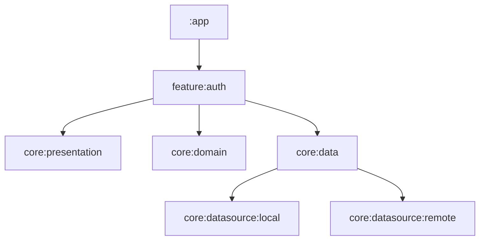

# Modules

## Folders

ShopSpot is structured for modularity and scalability using  both layered-based and feature-based modules, inspired by best practices from [Android Developers](https://developer.android.com/topic/modularization) and projects such as [Streeek](https://github.com/bizilabs/streeek/blob/main/docs/modules.md).

| Folder               | Description                                   |
|----------------------|-----------------------------------------------|
| app                  | Main application module                       |
| core                 | Contains shared core modules and abstractions |
| feature              | Contains feature modules                      |

## Modules

| Module                 | Folder                 | Description                                      | Dependencies                          |
|:-----------------------|:-----------------------|:-------------------------------------------------|:--------------------------------------|
| app                    | app                    | Mobile app entry point, navigation orchestration | `:feature:*`, `:core`                 |
| core:data              | core/data              | Data accessors, repositories, models             | `:core:datasource:*`, `:core:domain`  |
| core:datasource:local  | core/datasource/local  | Local data sources (Room DB, preferences)        | -                                     |
| core:datasource:remote | core/datasource/remote | Remote data sources (API services)               | `core:domain`                         |
| core:domain            | core/domain            | Business logic, use cases                        | -                                     |
| core:presentation      | core/presentation      | Shared presentation logic, utilities             | -                                     |
| feature:module-name    | feature/module         | Module screens and logic                         | `:core:domain`, `:core:presentation`  |

## Modularization Approach

- **Feature-Based Structure:** Each high-level feature resides in its own Gradle module, promoting separation of concerns and easier maintenance.
- **Core Abstractions:** Shared logic and UI (networking, data, domain, presentation) are centralized in `core` modules, which feature modules depend on.
- **Dependency Injection:** Core services are injected using [Koin](https://insert-koin.io/) for loose coupling.
- **Navigation:** The `app` module orchestrates navigation and depends on all feature modules.
- **Scalability:** New features can be added as separate modules with minimal impact on existing code.

## Example Dependency Graph

*Citation: Structure and documentation inspired by [Streeek](https://github.com/bizilabs/streeek/blob/main/docs/modules.md) and [Android Modularization Guide](https://developer.android.com/topic/modularization).*
